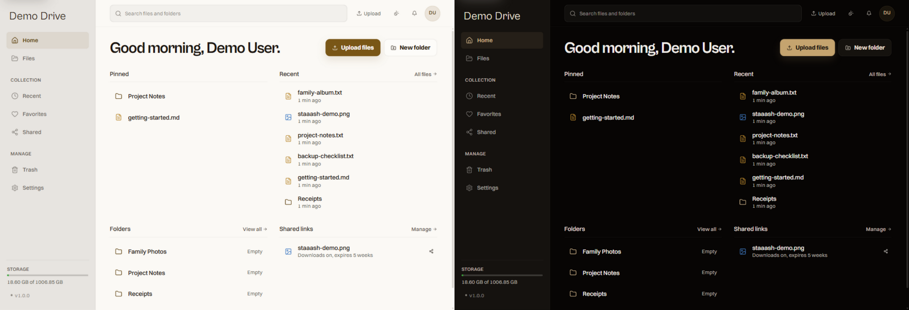
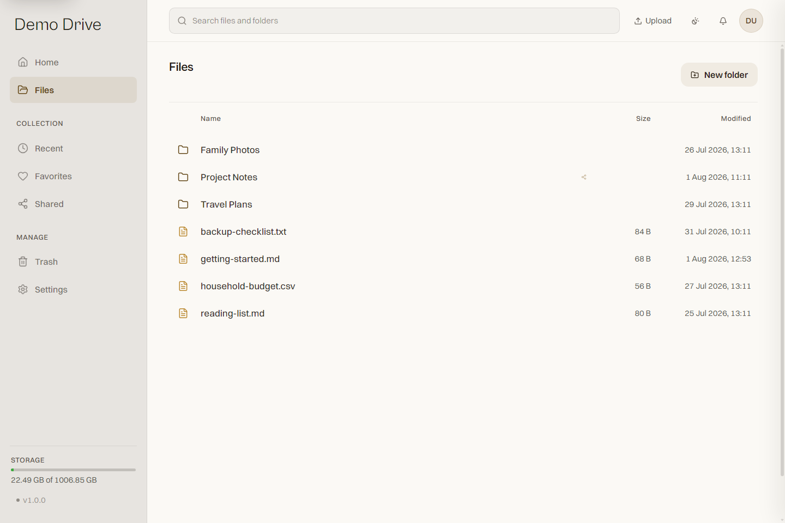
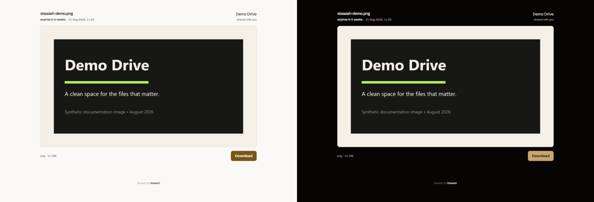

<div align="center">
<p align="center">
  <picture>
    <source media="(prefers-color-scheme: light)" srcset="../design/App/Staaash%20App%20Icon-White%400.25.png">
    <source media="(prefers-color-scheme: dark)" srcset="../design/App/Staaash%20App%20Icon%400.25.png">
    
  </picture>
</p>
<h1>Staaash</h1>

[](../LICENSE)
[](https://github.com/itsmeares/staaash/releases)
[](https://github.com/itsmeares/staaash/pkgs/container/staaash)
[](#installation)

</div>

> [!IMPORTANT]
> **Staaash v1.0 is the first stable release line.** Staaash is a file drive, not a backup system. Keep an independent backup of every important file you store in it and test that you can restore it.

---

<p align="center">A private, self-hosted file drive for people who want their files on storage they control.</p>

Staaash gives individuals, families, and small trusted groups a browser-based drive without handing their files to a third-party cloud. It combines everyday file management and public sharing with explicit local-storage behavior, an operator-facing admin area, and recovery that fails closed when filesystem state is ambiguous.

<table>
  <tr>
    <td>
      <picture>
        <source media="(prefers-color-scheme: dark)" srcset="../docs/assets/readme/home-dashboard-dark.png">
        
      </picture>
    </td>
  </tr>
  <tr>
    <td>
      <picture>
        <source media="(prefers-color-scheme: dark)" srcset="../docs/assets/readme/files-dark.png">
        
      </picture>
    </td>
  </tr>
  <tr>
    <td>
      <picture>
        <source media="(prefers-color-scheme: dark)" srcset="../docs/assets/readme/share-page-dark.png">
        
      </picture>
    </td>
  </tr>
</table>

## Features

- **Files and folders:** upload, create folders, preview, download, rename, move, favorite, search, trash, restore, and permanently delete.
- **Reliable transfers:** resumable uploads, per-user quotas, bounded staging capacity, upload progress, and generated ZIP downloads for selections and folders.
- **Useful views:** home dashboard, recent items, favorites, shared links, path-aware search, and responsive desktop and mobile navigation.
- **Public sharing:** links for files and folders with expiry, optional passwords, download controls, media previews, and revocation.
- **Multiple users:** owner and admin management, per-user storage limits, temporary passwords, required password changes, and authorized-session controls.
- **Media support:** inline image, audio, video, PDF, and text viewing, with optional FFmpeg-generated video previews handled by the worker.
- **Operations:** health and integrity status, storage usage, job history, update checks, restore reconciliation, and crash-recoverable storage mutations.

## Requirements

- Docker Engine or Docker Desktop with the Docker Compose plugin.
- A host that can run Linux AMD64 containers. The published v1 image currently targets `linux/amd64`; there is no native ARM64 image.
- A local, same-volume filesystem for uploaded files with atomic rename plus working file and directory `fsync`.
- Enough disk space for PostgreSQL, original files, temporary uploads, previews, and generated archives.

The supplied Compose stack runs PostgreSQL 18 and exposes Staaash on port `2113`. Network filesystems, object-storage mounts, and S3-compatible backends are not supported storage locations.

## Installation

1. Open the [GitHub Releases page](https://github.com/itsmeares/staaash/releases) and select the release you want. For the first stable release, use `v1.0.0`.
2. Download that release's `docker-compose.yml` and `example.env` into the same empty folder. Release assets select the exact release tag; files on `main` may contain unreleased changes.
3. Rename `example.env` to `.env`.
4. Set `DB_PASSWORD` in `.env` to a long, unique alphanumeric value. Set custom storage paths before first start if you do not want the defaults.
5. Start the stack:

   ```console
   docker compose up -d
   ```

6. Open `http://localhost:2113` and complete the initial setup. The first account becomes the owner and an admin.

Additional users are created by an owner or admin from **Admin → Users**. Staaash issues or accepts a temporary password and can require the user to replace it at first sign-in; it does not use email invitation links.

### Configuration

| Variable             | Default      | Purpose                                                                 |
| -------------------- | ------------ | ----------------------------------------------------------------------- |
| `STAAASH_VERSION`    | `latest`     | Image tag. Release assets replace this with their exact release tag.    |
| `UPLOAD_LOCATION`    | `./library`  | Host directory for uploaded files and app-managed storage artifacts.    |
| `DB_DATA_LOCATION`   | `./postgres` | Host directory for the PostgreSQL 18 data directory.                    |
| `DB_USERNAME`        | `postgres`   | PostgreSQL username used by the supplied Compose stack.                 |
| `DB_DATABASE_NAME`   | `staaash`    | PostgreSQL database name used by the supplied Compose stack.            |
| `DB_PASSWORD`        | `change-me`  | Required PostgreSQL password; change before first start.                |
| `STAAASH_PUBLIC_URL` | unset        | Canonical public URL for generated share links and embed metadata.      |
| `SECURE_COOKIES`     | automatic    | Optional `true` or `false` override for automatic HTTP/HTTPS detection. |

The two data paths are relative to the folder containing `docker-compose.yml`. Change them in `.env`, not in the Compose volume definitions.

### Reverse proxies and public links

Staaash can run behind Caddy, Nginx, Traefik, or another reverse proxy. Use one public address consistently, preserve the original `Host` header, and forward `X-Forwarded-Proto: https` when TLS terminates at the proxy. Staaash deliberately rejects cross-origin mutating requests when the browser `Origin` host and request `Host` do not match.

Set `STAAASH_PUBLIC_URL` to the canonical HTTPS address when generated share links and Discord media embeds must use it. See the [reverse-proxy guide](../docs/operations/reverse-proxy.md) and [public-sharing guide](../docs/operations/public-sharing.md) for the supported setup.

### Verifying a release

Each release also provides:

- `release-manifest.json`, containing the verified Git tag, commit, OCI index digest, immutable image reference, platform, and labels;
- `SHA256SUMS`, covering the Compose file, environment file, and release manifest.

Use the files from the same GitHub Release. Advanced deployments can pin the manifest's immutable `<tag>@sha256:<digest>` value as `STAAASH_VERSION`; ordinary installs should keep the readable exact tag generated in the release environment file. Container UIs such as CasaOS should select that same readable tag.

## Upgrading

1. Read the target release notes and take a complete offline backup.
2. Change `STAAASH_VERSION` in `.env` to the target release tag.
3. Replace `docker-compose.yml` only when the target release notes say its Compose definition changed.
4. Pull and restart:

   ```console
   docker compose pull
   docker compose up -d
   ```

Database migrations run automatically on startup. Compatible installations in the PostgreSQL 18 RC/v1 release line can upgrade in place. Alpha and beta deployments are unsupported development history: create a fresh current installation and do not reuse their internal database or storage directories as current data directories.

After an upgrade, check the version badge and **Admin → Overview**. Storage-protocol upgrades may temporarily keep writes unavailable while the worker completes recovery; follow the target release notes and the [storage-mutation recovery guide](../docs/operations/storage-mutation-recovery.md).

## Storage, Backup, and Restore

Staaash is a modular monolith with two application runtimes:

- the Next.js web app handles the product UI and request-time behavior;
- the worker handles durable cleanup, previews, archives, reconciliation, and storage-mutation recovery.

PostgreSQL is the metadata and durable-intent authority. Original bytes live on the configured local filesystem in human-readable logical paths. Rename, move, trash, and restore operations are recorded in a PostgreSQL mutation journal before filesystem changes begin; interrupted work rolls forward, while ambiguous state preserves possible bytes and requires operator review.

Back up `UPLOAD_LOCATION` and `DB_DATA_LOCATION` together while the web app, worker, and PostgreSQL are stopped. A backup containing only one location is incomplete. Test restores on a separate clean deployment before trusting them. Follow the complete [backup and restore checklist](../docs/operations/backup-restore.md).

## Current Limitations

- One modular application stack with a separate worker; no microservice deployment mode.
- Linux AMD64 image only; no native ARM64 release image.
- Local, same-volume app-managed storage only; no S3, object storage, or network filesystem support.
- No desktop sync client or native mobile application.
- No shared workspaces or internal collaboration permission model in v1.
- External tools may read storage for backup, but editing app-managed paths outside Staaash is unsupported.
- Owner authority is operational and does not provide a normal-app bypass into another user's private files.

## Documentation

- [Architecture](../docs/architecture.md) — system shape, storage model, and design boundaries
- [Backup and restore](../docs/operations/backup-restore.md) — offline backup and restore drill
- [Public sharing](../docs/operations/public-sharing.md) — canonical share URLs and HTTPS embeds
- [Reverse proxy](../docs/operations/reverse-proxy.md) — Caddy example and proxy requirements
- [Resumable uploads](../docs/operations/resumable-uploads.md) — capacity, cleanup, and recovery behavior
- [Storage mutation recovery](../docs/operations/storage-mutation-recovery.md) — filesystem requirements and recovery operations
- [Releasing](./RELEASING.md) — maintainer release identity, verification, and recovery flow

## Local Development

Staaash is a PNPM workspace monorepo built with Next.js, React, TypeScript, Prisma, PostgreSQL, and a separate Node.js worker.

### Repository layout

- `apps/web` — web app, server modules, and API routes
- `apps/worker` — background worker runtime
- `packages/config` — shared runtime and TypeScript configuration
- `packages/db` — Prisma schema, generated client, and database helpers
- `docs` — architecture and operations guidance
- `scripts` — maintenance and release utilities

### Development setup

Use Node.js 24.18.0, Corepack, the repository-pinned pnpm version, and PostgreSQL 18.

1. Copy `dev.example.env` to `.env.local` at the repository root.
2. Start PostgreSQL and update `DATABASE_URL` if it does not use the example connection details.
3. Install and prepare the workspace:

   ```console
   corepack enable
   corepack install
   pnpm install
   pnpm db:generate
   pnpm db:push
   ```

4. Start the web app and worker in separate terminals:

   ```console
   pnpm web:dev
   pnpm worker:dev
   ```

FFmpeg is required on the worker host when testing generated video previews outside the production container.

The local reset command deletes the configured development upload tree and force-resets the development database. Run it only when those exact targets are disposable:

```console
pnpm app:reset-local-data
```

## Testing and Quality

```console
pnpm format:check
pnpm lint
pnpm quality:fallow
pnpm test
pnpm test:postgres
pnpm build
```

PostgreSQL integration and browser E2E suites require isolated disposable data. Do not point their reset/bootstrap commands at a normal development or production database.

## Contributing and Feedback

- Read [CONTRIBUTING.md](./CONTRIBUTING.md) before opening work.
- Use the GitHub issue forms for bug reports and feature requests.
- Use the pull request template for proposed changes.
- Report security problems privately as described in [SECURITY.md](./SECURITY.md).

## Star History

<a href="https://www.star-history.com/?repos=itsmeares%2Fstaaash&type=date&legend=top-left">
 <picture>
   <source media="(prefers-color-scheme: dark)" srcset="https://api.star-history.com/chart?repos=itsmeares/staaash&type=date&theme=dark&legend=top-left&sealed_token=UHRaESlFsL6wEjhGWmYcPJqvZFoZK-N_xIHVWOWy4kKhq8ZYJuKTMpJi09dAvcpieHap5Zd34rDwLcRB8J76DtihUUNdF0dL5HlDf8Z4wmKmwjXWpCsxhSOyLkOiK3RMtbfbdO7mhyoa992eaK6nXCAGca6VDfWzzqEchSs1aGe72bBJ2njHIAWEeGm9" />
   <source media="(prefers-color-scheme: light)" srcset="https://api.star-history.com/chart?repos=itsmeares/staaash&type=date&legend=top-left&sealed_token=UHRaESlFsL6wEjhGWmYcPJqvZFoZK-N_xIHVWOWy4kKhq8ZYJuKTMpJi09dAvcpieHap5Zd34rDwLcRB8J76DtihUUNdF0dL5HlDf8Z4wmKmwjXWpCsxhSOyLkOiK3RMtbfbdO7mhyoa992eaK6nXCAGca6VDfWzzqEchSs1aGe72bBJ2njHIAWEeGm9" />
   
 </picture>
</a>

## License

AGPL-3.0 — see [LICENSE](../LICENSE).
